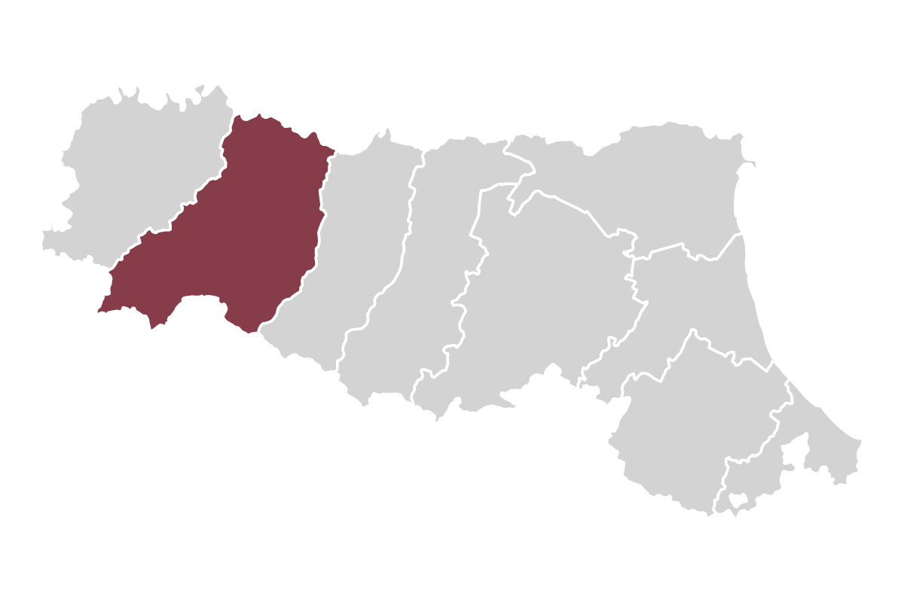

::: {.grid}

::: {.g-col-12 .g-col-md-5}
{fig-alt="La provincia di Parma nell'Emilia-Romagna"}
:::

::: {.g-col-12 .g-col-md-7}
Analisi sulla provincia di Parma, in confronto con l'Emilia-Romagna e con l'Italia, per leggere i bisogni del territorio e orientare gli interventi; dati aperti da fonti ufficiali (ISTAT, Ministero dell'Istruzione, Regione Emilia-Romagna, ecc.), sempre citate.

Le pagine del sito corrispondono a moduli tematici. Ognuna riporta una sintesi, grafici e tabelle con dati scaricabili e piste di lavoro aperte. Dati aggiornati a settembre 2026.

::: {.callout-warning appearance="simple"}
Alcune pagine sono in preparazione. 
:::
:::

:::

---

**Autore**: A cura dell'_Osservatorio dei Dati Sociali di Fondazione Cariparma_. Codice sorgente e contatti a piè di pagina.

**Utilizzo**: testi, grafici e tabelle con licenza [CC BY 4.0](https://creativecommons.org/licenses/by/4.0/); i dati di origine restano soggetti alle licenze delle rispettive fonti.
